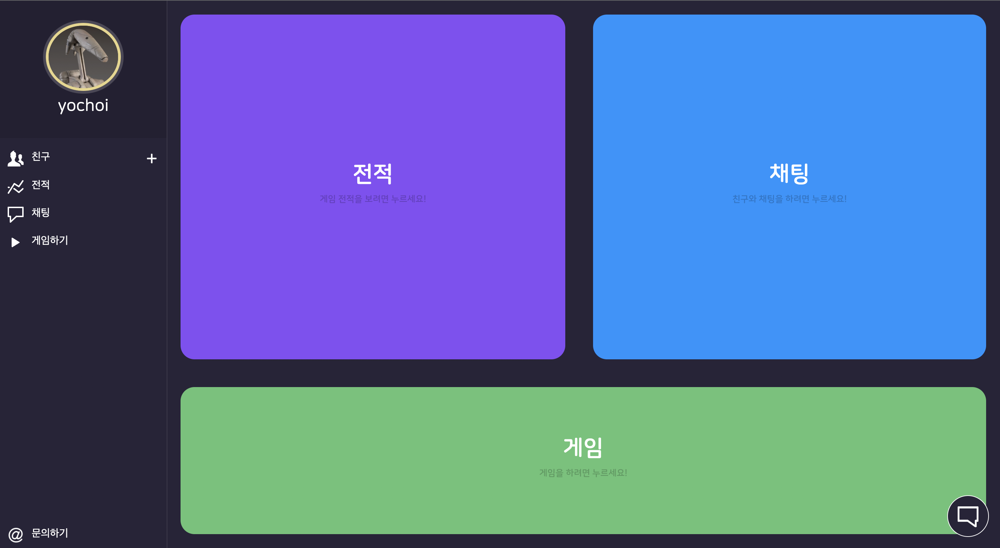

<div id="top"></div>

[![Contributors][contributors-shield]][contributors-url]
[![Forks][forks-shield]][forks-url]
[![Stargazers][stars-shield]][stars-url]
[![Issues][issues-shield]][issues-url]
[![MIT License][license-shield]][license-url]

<br />
<div align="center">
  <a href="https://github.com/AMATEURTOSS/ft_transcendence">
    
  </a>

<h3 align="center">ft_transcendence</h3>

  <p align="center">
    Cool Ping Pong Game Site
    <br />
    <a href="https://github.com/AMATEURTOSS/ft_transcendence/issues">Report Bug</a>
    ·
    <a href="https://github.com/AMATEURTOSS/ft_transcendence/issues">Request Feature</a>
  </p>
</div>

<details>
  <summary>Table of Contents</summary>
  <ol>
    <li>
      <a href="#about-the-project">About The Project</a>
      <ul>
        <li><a href="#contributors">Contributors</a></li>
        <li><a href="#built-with">Built With</a></li>
      </ul>
    </li>
    <li>
      <a href="#getting-started">Getting Started</a>
      <ul>
        <li><a href="#prerequisites">Prerequisites</a></li>
        <li><a href="#start">Start</a></li>
      </ul>
    </li>
    <li><a href="#license">License</a></li>
  </ol>
</details>

## About The Project



<p align="right">(<a href="#top">back to top</a>)</p>

### Contributors

<a href="https://github.com/AMATEURTOSS/ft_transcendence/graphs/contributors">
  
</a>

Made with [contrib.rocks](https://contrib.rocks).

### Built With

* [React.js](https://reactjs.org/)
* [NestJs](https://nestjs.com/)
* [TypeScript](https://www.typescriptlang.org/)

<p align="right">(<a href="#top">back to top</a>)</p>

## Getting Started

This is an example of how you may give instructions on setting up your project locally.
To get a local copy up and running follow these simple example steps.

### Prerequisites

* docker
* docker-compose
* browser (Chrome, Firefox, Safari, etc...)

### Start

1. Clone the repo
   ```sh
   git clone https://github.com/AMATEURTOSS/ft_transcendence.git
   ```
2. Start Container
   ```sh
   docker-compose up -d
   ```
3. Access 127.0.0.1 with your browser
   ```sh
   curl 127.0.0.1
   ```

<p align="right">(<a href="#top">back to top</a>)</p>

## License

Distributed under the MIT License. See `LICENSE` for more information.

<p align="right">(<a href="#top">back to top</a>)</p>

<!-- MARKDOWN LINKS & IMAGES -->
<!-- https://www.markdownguide.org/basic-syntax/#reference-style-links -->
[contributors-shield]: https://img.shields.io/github/contributors/AMATEURTOSS/ft_transcendence.svg?style=for-the-badge
[contributors-url]: https://github.com/AMATEURTOSS/ft_transcendence/graphs/contributors
[forks-shield]: https://img.shields.io/github/forks/AMATEURTOSS/ft_transcendence.svg?style=for-the-badge
[forks-url]: https://github.com/AMATEURTOSS/ft_transcendence/network/members
[stars-shield]: https://img.shields.io/github/stars/AMATEURTOSS/ft_transcendence.svg?style=for-the-badge
[stars-url]: https://github.com/AMATEURTOSS/ft_transcendence/stargazers
[issues-shield]: https://img.shields.io/github/issues/AMATEURTOSS/ft_transcendence.svg?style=for-the-badge
[issues-url]: https://github.com/AMATEURTOSS/ft_transcendence/issues
[license-shield]: https://img.shields.io/github/license/AMATEURTOSS/ft_transcendence.svg?style=for-the-badge
[license-url]: https://github.com/AMATEURTOSS/ft_transcendence/blob/master/LICENSE
[linkedin-shield]: https://img.shields.io/badge/-LinkedIn-black.svg?style=for-the-badge&logo=linkedin&colorB=555
[linkedin-url]: https://linkedin.com/in/linkedin_username
[product-screenshot]: images/screenshot.png
